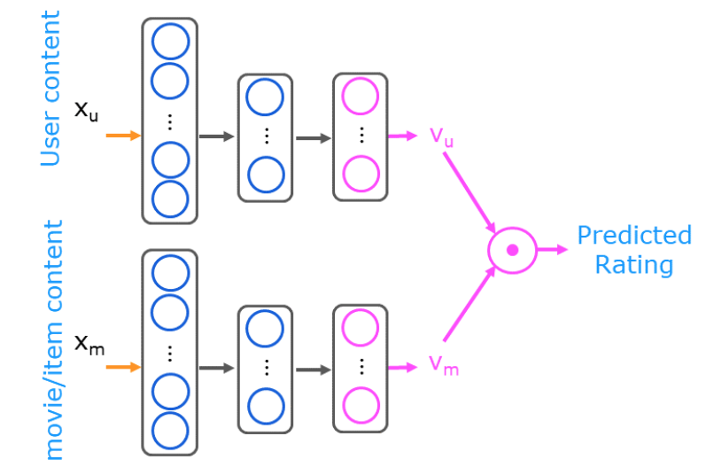
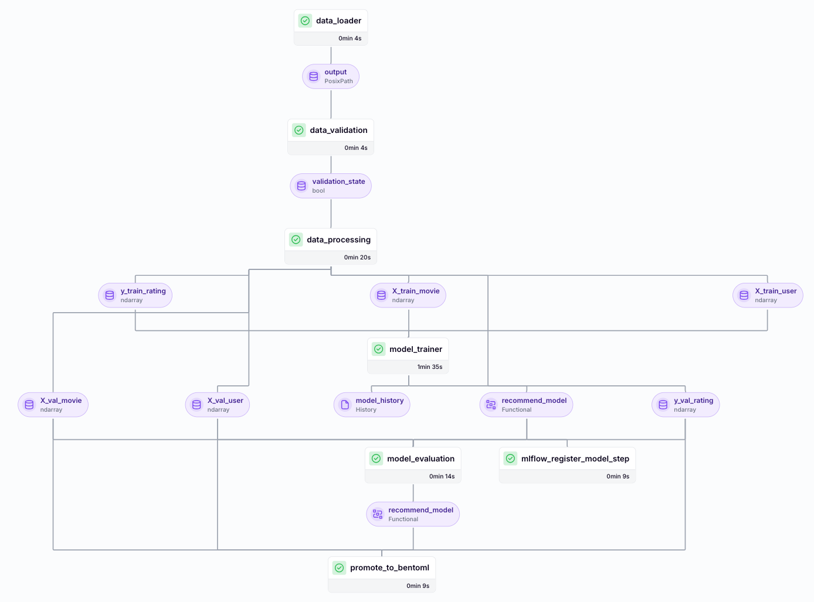

# Movie Recommendation System with MLOps Integration

**Overview**  
An end-to-end machine learning system for personalized movie recommendations, powered by a **content-based algorithm** built with TensorFlow/Keras. The project leverages modern MLOps tools like ZenML, MLflow, Evidently, and BentoML for robust pipeline orchestration, validation, and deployment.

---

## 🔥 **What’s Blazing Under the Hood?**

- **TensorFlow/Keras Content-Based Algorithm**: Neural networks that analyze user preferences and movie metadata to predict ratings with surgical precision.
- **ZenML Orchestration**: Unifies the ML workflow with automated pipelines, artifact tracking, and tool integrations.
- **Evidently**: Validates data quality and model performance in production-like scenarios.
- **MLflow**: Tracks experiments, logs metrics, and manages model registry.
- **BentoML**: Streamlines cloud deployment with containerized model serving.

---

## 🏗️ **Project Architecture**

### Pipeline Definition

1. **Data Ingestion**:

   - Collects movie ratings and metadata from CSV datasets.

2. **Data Validation**:

   - **Schema Validation**: Ensures CSV files match predefined schemas (column names, data types).
   - **Data Range Check**: Validates ratings fall within 0.5–5.0 to prevent target leakage.

3. **Model Training**:

   - Dual-tower neural network architecture:
     - **User Tower**: Embeds user preferences.
     - **Movie Tower**: Encodes movie attributes.
   - 
   - Logs metrics/artifacts to MLflow and registers models in the MLflow registry via ZenML.

4. **Model Evaluation**:

   - Computes accuracy, RMSE, and user-specific ranking metrics.

5. **Model Registry**:

   - Version-controlled model storage in MLflow.

6. **BentoML Promotion**:
   - Packages validated models for cloud deployment.

---

## 🛠️ **Tech Stack**

- **ML Framework**: TensorFlow 2.x, Keras
- **MLOps**: ZenML, MLflow (experiment tracking/model registry), Evidently (validation), BentoML (deployment)
- **Data Tools**: Pandas, NumPy, Scikit-learn

---

## 🚀 **Running This Project**

### Prerequisites

- Python 3.10
- ZenML Cloud Account
- BentoML Cloud Account
- MLflow Server (e.g., hosted on DagsHub)

### Installation

1. Clone the repository:
   ```bash
   git clone https://github.com/Ntchinda-Giscard/recomProject.git
   ```
2. Create a virtual environment:
   ```bash
   python -m venv .venv && source .venv/bin/activate
   ```
3. Install dependencies:
   ```bash
   pip install -r requirements.txt
   ```

### ZenML Stack Setup

```bash
# Register components
zenml model-deployer register bentoml_deployer --flavor=bentoml
zenml model-registry register mlflow_registry --flavor=mlflow
zenml experiment-tracker register mlflow_tracker --flavor=mlflow
zenml data-validator register evidently_validator --flavor=evidently

# Create and activate stack
zenml stack register my_stack \
    -d bentoml_deployer \
    -r mlflow_registry \
    -e mlflow_tracker \
    -v evidently_validator \
    -o default \
    -a default

zenml stack set my_stack
```

### Execution

1. Run the pipeline:
   ```bash
   python main.py
   ```
   Pipeleine overview:
   - 
2. Deploy to BentoML Cloud:

   ```bash
   bentoml cloud login \
       --api-token 'YOUR_API_TOKEN' \
       --endpoint 'https://bensto-space.cloud.bentoml.com'

   bentoml deploy --name recommend-system .
   ```

---

## 📄 **License**

MIT License. See `LICENSE` for details.

**Need Help?** Open an issue or contact [@Ntchinda-Giscard](https://github.com/Ntchinda-Giscard).

---

This version balances technical clarity with readability while showcasing your MLOps rigor. Let me know if you’d like adjustments! 🚀
